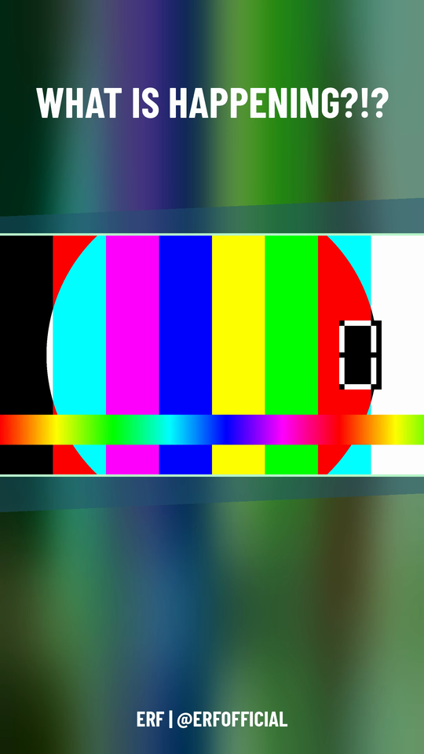

# Layout



The tool's repository holds code; a **workspace** holds channels, events,
clips and everything derived from them — see
[Where the data lives](Where-the-data-lives).

```
YT-Shorts/                      the repository: code only
  bin/yt-shorts              command line
  src/yt_shorts/
    workspace.py               resolves where the data lives
    clipid.py                   a clip's identity: its source URL
    clipstore.py                 one clip, one directory
    editorial.py                  hand-made corrections, additive over derived data
    migrate.py                     copies an old-layout event into a workspace
    timecode.py                     time arithmetic (pure logic)
    harvest.py                       clip addresses -> timecodes (calls yt-dlp)
    render.py                          loads the clip and composes it with the overlay
    overlay.py                          the brand overlay as a PNG (Pillow)
    gallery.py                           overview page for review
    brand.py                              loads a brand.json, makes font paths absolute
    merge.py                               deep_merge: event overrides channel, key by key
    profile.py                              resolves 'channel/event', layers event over channel
    preview.py                               a preview PNG at a timestamp, from raw.mp4
    job_queue.py                             the job queue: order, pools, jobs.json (pure)
    cancel.py                                 a cancellation token, and how a stop reaches a subprocess
    studio/                                   the local editor - see the Studio page
      api.py                                    FastAPI app: clips, edit.json, render jobs
      jobs.py                                    background jobs the studio starts and polls
      worker.py                                   the one thread that drives the queue
      web/                                       source: React + Vite + Mantine (TypeScript)
      static/                                    BUILT output `npm run build` writes - not committed
  templates/example-channel/     copy into a workspace to start a new channel
    channel.json                   placeholder values, see the template's own README.md
    brand.json                       placeholder values
    README.md                          what to change and where to put fonts
  tests/fixtures/channels/erf/   the ERF channel as a test fixture, owned by the
                                    suite (see tests/conftest.py) - not a channel to
                                    render from; a stand-in the tests own

~/YT-Shorts-Data/                the workspace (or the repository's own
  channels/                        channels/, until a workspace exists -
                                    empty/absent in a fresh checkout)
    erf/
      channel.json             channel ID, handle, language, footer, display name
      brand.json                 colors, fonts, output dimensions
      fonts/                      this channel's fonts
      assets/                      optional: this channel's assets (e.g. a logo)
      layout.py                    optional: the channel-specific accent element
      events/
        community-clips-back-catalogue/
          sources.json        collected by hand (see the workflow)
          clips/
            speedy--a3f19c2b/
              clip.json           derived: URL, timecodes, harvested title
              edit.json           editorial: title, status, corrections - only
                                   once a human has actually touched the clip
              transcript.json      derived (cache)
              raw.mp4               derived (cache)
              short.mp4             derived (output) - always the deliverable,
                                     already cut if a trim is applied
              short.full.mp4        derived (cache) - the untrimmed master,
                                     present only while a trim is applied;
                                     a re-render recreates it
              short.trim.json       derived - which trim short.mp4 currently
                                     embodies (absent means no trim)
          brand.json           optional: partial override, this event only
          fonts/                 optional: additional/overriding fonts
          assets/                optional: this event's assets (e.g. a logo)
          layout.py              optional: this event's own decoration
  streams/                     derived, per stream: the downloaded audio,
    <video-id>/                  chunks/ (decoded chunks), windows/ (scored
                                 windows), transcript.json, moments.json
  auth/                        secrets: the OAuth client secret, one upload
                                 token per channel, the model-provider API keys,
                                 the local quota estimate - never committed
  logs/                        the central yt-shorts.log, its dated archives,
                                 and jobs/<kind>-<job-id>.log per background job
  jobs.json                    the job queue's plan: what is queued, running and
                                 recently finished (see "Jobs" under Studio)
  settings.json                this workspace's own settings - today the job
                                 queue's per-pool limits. Absent means every
                                 setting is at its default
```

Every clip lives under one directory, named from its harvested title and a
short hash of its source URL — the identity that never changes, even when
the title later gets a hand-made correction. Backing up, deleting or
inspecting one clip is one operation on that directory.
