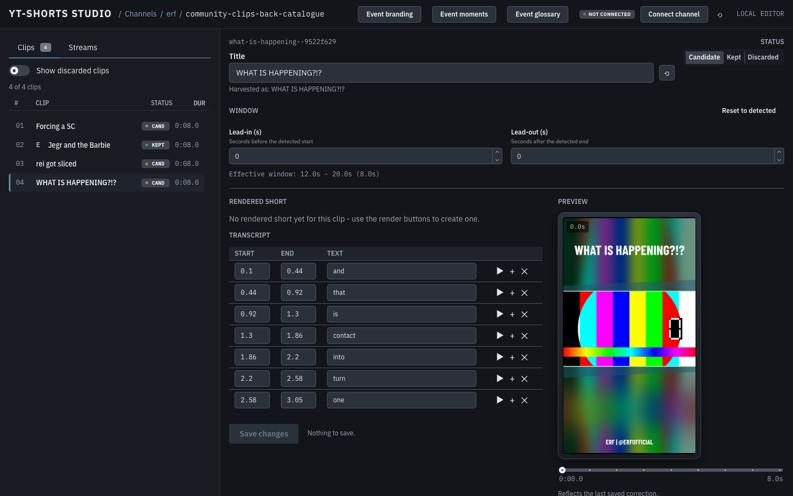

# Studio



A local, single-user web editor for reviewing a batch of clips after
`harvest` and `render` have run: fix a caption Whisper misheard, correct a
title, mark a clip kept or discarded, and see the result before uploading
anything. Your corrections go into `edit.json`; the studio never redefines a
clip's transcribed data, and never redefines an existing clip's window in
`clip.json`. Two things it writes besides, both only when you ask: the short
from a render you start (re-rendering replaces that clip's previous short,
which is the point of re-rendering), and a clip made from a window you pick
in the stream view (below) — creating a new one, or, if you re-pick the exact
same window (say, to fix the hook), updating that clip's `clip.json` in
place; it refuses to redefine an existing clip with a genuinely different,
colliding window. That rule in full, and the six shorter phrasings of it that
turned out to be false, is in
[`src/yt_shorts/studio/CLAUDE.md`](https://github.com/jegr78/yt-shorts/blob/main/src/yt_shorts/studio/CLAUDE.md).

```bash
bin/yt-shorts studio                              # start screen: pick a channel, then an event
bin/yt-shorts studio erf                          # deep-link straight to a channel's event list
bin/yt-shorts studio erf/community-clips-back-catalogue   # deep-link straight into the editor
```

Launch it with no argument to open a **start screen** that lists your
workspace's channels; pick one to see its events, pick an event to open the
editor. A channel or `channel/event` argument is a convenience deep link to
that screen.

On the start screen you can **add a channel** (a directory slug plus its
`channel.json` identity fields — id, channel_url, handle, display name, language,
footer), **edit** those fields, **rename** its slug (the URL moves, and all its
events come along), and **delete** a channel (you type the slug to confirm — this
removes the channel and all its events). Renaming or deleting a channel is refused
while one of its events is rendering.

Opening a channel shows two tabs: its **events** (below) and a **Brand** tab. On
the Brand tab you upload the channel's `.ttf`/`.otf` fonts, assign one to the
**hook** and one to the **small** text, edit the four brand colors (text, base,
accent, edge) and the subtitles on/off toggle, and see a **live preview** of the
overlay as you change them. A newly added channel is incomplete until a font is
uploaded and assigned here — that is what makes its events renderable. Output
dimensions stay at the portrait default and are not editable here; a font that is
currently assigned in the brand cannot be deleted until you reassign it.

An optional **band opacity** section sets how solid the overlay's upper and
lower thirds are — `1` (or omitted) is the usual full-strength look, `0`
leaves nothing there but the clip's own blurred backdrop, with the hook and
footer still drawn on top. Like every other brand setting it can be set
channel-wide and overridden per event, and both the channel's Brand tab and
the event's own brand drawer show a slider for each third. The channel's
Brand tab also has a **"Derive from logo"** button, which reads the
channel's `assets/logo.png` and proposes the four brand colors from it —
a starting point you still review and adjust before clicking Save brand.

On a channel's event list you can **create** a new (empty) event, **rename** an
event, and **delete** one (you type its name to confirm — delete is permanent).
A new event is populated the usual ways: the studio's Streams → detect flow, or
a CLI `harvest`. Renaming or deleting an event that a render or detect is
currently using is refused until that finishes. Inside an event the studio
writes `edit.json`; besides that it writes only a short (from a render you
start, replacing that clip's previous one) and a clip from a window you pick
in the stream view — a new clip directory, or, on an exact re-pick of the
same window, an in-place update of that clip's `clip.json` (a hook/title
correction, never its window). It never edits a clip's `sources.json`, and
never redefines an existing clip's window or its transcribed data. One thing
does rewrite a clip's cached `transcript.json`, and it is worth naming: a
render re-decodes and rewrites that cache when the `source` recorded in it
does not match the clip's current one. It is self-healing, it happens once,
and a CLI `render` does it identically — no studio route edits a
`transcript.json` itself.

A **Settings** page (reached from the start screen) shows a workspace panel — where
your data lives and where it was resolved from (`$YT_SHORTS_DATA`, the default
`~/YT-Shorts-Data`, or the repository fallback), and whether the optional upload
libraries are installed — plus a per-channel connection overview: for each owned
channel you can **connect**, **switch account**, or **disconnect**; render-only
channels are shown as such. Disconnect forgets the local token only (you type the
channel id to confirm); fully revoking the grant stays a manual step in your
Google account settings. The same page holds the workspace's **model provider**
API keys — one row per provider, paste or forget, never shown back — see
[Model providers](Model-providers).

The same panel lists recent workspaces and lets you switch between them, create
a new one, or copy the current one (a background job — a large workspace takes
a while). All three are refused while a job is running, and
refused outright while `$YT_SHORTS_DATA` pins the workspace — unset it to
manage workspaces here.

Prints the URL and opens it in your default browser. It serves on
`http://127.0.0.1:8765/` when that port is free; if it is busy (a studio you
left running, say) it moves to a free port, prints which one, and opens that
instead of failing. Needs FastAPI and uvicorn, which are **not** required by any other
command — `harvest`, `render`, `gallery` and `migrate` all work in a venv
that never installed them; running `studio` without them prints what to
install (`.venv/bin/pip install fastapi uvicorn`) instead of a traceback.

**The preview needs `raw.mp4`.** The clip's downloaded, caption-free video
is what a live preview is drawn on; it only exists once the clip has been
rendered at least once (`render` keeps it by default — see
[What the tool guarantees](https://github.com/jegr78/yt-shorts/blob/main/README.md#what-the-tool-guarantees)
and [Layout](Layout)). Selecting a clip
that has never been rendered shows an explanation instead of a broken
image, with what to do about it (render it).

**A conflict is shown, never silently resolved.** If a caption correction
was made against a transcript that has since changed (a re-transcription,
say), the studio still uses the correction — same rule as `render`, see
[The editorial layer](The-editorial-layer)
— but shows a banner naming what happened,
because only a human should decide whether it still applies.

**Listing a channel's streams.** `GET /api/streams` returns the channel's
catalogue — its finished streams (title, duration, view count, video id) plus
its playlists, composed by `yt_shorts.youtube.channel_catalogue` from several
`yt-dlp` calls (the streams tab, the playlist list, and every playlist's own
members, fetched in parallel); **no YouTube Data API key** and no quota are
involved (yt-dlp is already the tool's downloader). The catalogue is fetched
once per studio session and cached; `?refresh=true` re-fetches. A failed
playlist fetch is named rather than silently dropped and the rest of the
catalogue is still served; the streams tab's own failure returns a 502 with
an explanation rather than a broken panel, since without it there is no list
at all. Clicking a stream opens the stream view — a screen of its own at
`/{channel}/{event}/streams/{video_id}`, one level below the editor: the
stream's transcript, its two timeline lanes and, once detection has run, its
ranked hit list. It is where a window becomes a clip, and it is useful with no
API key at all — see [Moment detection](Moment-detection).

The Streams tab filters a channel's streams by its YouTube playlists (a
dropdown, not collapsible groups — every stream still lists in one flat
table, narrowed to the picked playlist). The list is the union of the
channel's Streams tab and every playlist's contents, so a broadcast that
lives only in a playlist is reachable too — on the ERF channel that is eight
videos, two of them multi-hour races. Each row shows whether that stream
already has a transcript and an analysis, and a playlist with dropped
(deleted or private) members says so in the filter itself, e.g. "ERF
Specials (1 + 2 unavailable)", rather than showing a plain count that quietly
excludes them.

Tick several rows and queue them in one action: **Transcribe**, **Detect
moments**, or **Transcribe + detect**, which chains each detection behind
its own transcription so it starts only once there is something to score.
A stream that already has what the action would produce is skipped, and the
bar says how many before you click. That is not because a re-run is
expensive by nature — re-transcribing a stream that already has one
ordinarily reuses its downloaded audio and every cleanly-decoded chunk, so
it costs a metadata call and a re-assembly rather than a re-download, and
re-detecting one that already has a model-backed analysis ordinarily costs
nothing at the model provider, because a scored window is cached too. The
skip exists because neither is *always* cheap — a workspace whose audio or
cached chunks were cleared really does re-download and re-decode, a changed
provider, model or marker set really does spend money again, a re-decoded
transcript (say, after a glossary edit) makes every previously-scored window
a miss, and an analysis produced with no model available at the time (the
lexicon fallback) cached no windows at all, so the first model-backed detect
over it re-scores the whole stream — and a bulk click over many rows should
not gamble on which case it is. Tick "anyway" to override either. A per-row
**Transcribe**/**Detect moments** click, by contrast, always does the work
for that one stream regardless — the skip is the bulk bar's protection
against many rows at once, not a rule that also applies to a single
deliberate click.

Nothing starts on the click: everything goes into the queue, and the Jobs
screen is where the whole plan lives.

**Jobs: the queue and the Jobs screen.** The studio keeps a queue of planned
work in `<workspace>/jobs.json`, and the **Jobs** screen (from the start
screen, or `/jobs`) shows it in three sections: what is running, what is
queued, and what recently finished. The plan survives a restart; what was
running when the studio stopped comes back as `interrupted` and waits for you.

**One studio per workspace.** Two of them share one `jobs.json` and would
overwrite each other's plan, so a second `bin/yt-shorts studio` on the same
workspace refuses and says who holds it. (It picks a free port when 8765 is
busy, so without this it would simply start.) A studio that crashed leaves its
lock behind; the next one takes it over and says so, the same way a stale
render lock is handled.

**Four of the five buttons queue their work now.** Transcribe (a channel's
Streams tab and the stream view — still the only way to get a transcript from
the studio at all, see
[Moment detection](Moment-detection)),
**Detect moments**,
**Render** and **Apply trim** all write an entry into this plan instead of
starting a job on the click, so each of them can be scheduled, reordered,
paused and stopped, and each shows up here.

The consequence to expect: **a click no longer starts anything.** The panel you
clicked in says "Queued — not started yet" and names why — the worker is not
running, another job holds that event's lock, or (for a chained "Transcribe +
detect") the detect entry is still waiting on its own transcription to finish
— instead of showing a spinner for work that has not begun. Queuing itself is
never refused: it takes no lock, so a render can be planned while a detection
is running, and the worker waits for the event rather than failing the entry.

**Upload is the one that still starts directly**, deliberately. It cannot be
stopped at any level, and a non-private or scheduled upload needs a
confirmation given per upload — which an entry written now and run hours later
from a state file cannot carry (`POST /api/jobs` refuses a queued upload that
is not private for exactly that reason). The direct API routes behind these,
and the rest of the queue's own design, are in
[`src/yt_shorts/studio/CLAUDE.md`](https://github.com/jegr78/yt-shorts/blob/main/src/yt_shorts/studio/CLAUDE.md).

How many run at once is per **pool**, not one number: `cpu` (transcribe,
render, trim) defaults to **1** and `net` (detect, upload) to **3**, because a
transcription pins the processor for hours while a detection mostly waits on a
model API. The Jobs screen shows the current limits read-only; the Settings
screen's own "Job queue limits" panel is where you change them, one pool at a
time, and it says what the number does right above the fields rather than in a
tooltip: a limit is **per workspace** — not per event, not per channel — and
raising `cpu` past your machine's own core count makes everything slower, not
faster, because renders and transcriptions start fighting each other for the
same cores instead of running one at a time. Saving writes
`<workspace>/settings.json` **and** re-points the live queue immediately, no
restart needed. Lowering a limit below what is already running never kills or
double-counts anything — the running work finishes normally, and the pool
simply claims no new work until it is back under the new limit.

What each state means:

| state | what it means |
|---|---|
| `queued` | waiting its turn. Its `reason`, if it has one, says what for — most often "waiting for the event lock", i.e. a CLI render or another job is using that event. Normal and temporary |
| `paused` | you paused it before it started; it keeps its place in line, and cannot be reordered until you resume it |
| `running` | started, with a job log of its own under `logs/jobs/` |
| `stopping` | you asked it to stop and it has not reached its safe point yet. It still holds its pool slot, because the work is still using the machine |
| `done` | finished. Drop it from the list when you like |
| `failed` | finished badly, with the reason on the row — **Retry** puts it back in the queue |
| `stopped` | you stopped it. Not a failure — and **Retry** re-queues it, resuming from the first chunk or window nobody reached |
| `interrupted` | it was running when the studio died. It never restarts by itself — only **Retry** re-queues it, because a detection run spends real money |

**Stopping is an ask, not a switch.** A stop takes effect at the kind's own
safe point — after the current chunk, clip, cut or window — which for a long
chunk can be minutes away, and the screen says so before you click. A **hard
stop** is offered where it is safe: it terminates the subprocess the work is
waiting on, never the Python thread, so the job still runs its own cleanup and
reports "stopped" — that is what stops a cancel from leaving a half-written
short behind. **An upload cannot be stopped at any level** and no button is
offered for one: a half-finished upload to YouTube is worse than waiting.

**What costs money, and what a stop costs.** Only **detect** spends money (the
model API — see [Model providers](Model-providers));
**upload** spends YouTube API quota; the
rest cost time and CPU. Stopping either long kind costs nothing to re-run:
transcription resumes at the first missing chunk and detection at the first
unscored window, because both cache their own unit of work. What a stopped
detection does lose is the *rest of the stream* — nothing is scanned after the
stop, and no analysis file is written at all until a run completes, so re-run
it when you want the whole picture.

Two things worth knowing. The queue only moves while `bin/yt-shorts studio` is
running (any other way of building the app leaves the worker stopped, and the
screen says so rather than looking idle). And **progress is reported by the
three long kinds and by no others**: a running transcription says "chunk 20 of
50", a detection "window 3 of 9" and a render "clip 2 of 6", each advancing as
its own unit of work finishes. A trim is a single cut and an upload's bytes go
somewhere the tool does not watch, so those two rows show nothing at all rather
than an invented "1 of 1" — and no row shows a reading before its first unit is
done, or after it has stopped running. Use a job's log for anything finer.

Only one job (studio- or CLI-started) can work on an event at a time — the
same `EventLock` `render` itself uses. A queued entry whose event is locked
waits and says so; it is never failed for it. The *plan* is what survives a
restart, not a running job's own progress record: a job's own record (its
per-clip results) lives in memory and is gone when the studio process is,
though its log under `logs/jobs/` stays and the entry itself is still in the
plan afterwards. An upload, which starts directly, has no entry at all — close
the studio mid-upload and there is nothing but its log.

**The frontend is built, not committed.** `src/yt_shorts/studio/web/` is
a React + Vite + Mantine (TypeScript) project; `src/yt_shorts/studio/api.py`
serves its *built* output from `src/yt_shorts/studio/static/`. That directory
is git-ignored: the release binary and a `pip`-installed wheel each build it
on the way in, so an operator never needs Node — a developer working from a
clone needs `^22.22.2 || ^24.15.0 || >=26.0.0` of it (see
[CONTRIBUTING.md](https://github.com/jegr78/yt-shorts/blob/main/CONTRIBUTING.md)
and [Building from source](Building-from-source)):

```bash
cd src/yt_shorts/studio/web
npm install
npm run build          # typechecks, then writes into ../static/
npm test               # Vitest unit tests (see below)
```

The frontend has unit tests (Vitest, jsdom) covering its pure logic — the
duration formatters (`format.ts`), the effective-window reconstruction
(`window.ts`), word equality (`words.ts`), upload-url extraction, the
brand form's hex/ready-to-save/font-filename rules (`brand.ts`), the Jobs
screen's state labels, allowed actions and stop warnings (`jobs.ts`), and the
job-polling hook. Run them with `npm test`. They are a **required check before
committing a frontend change**, alongside `npm run build`, and are **separate**
from the Python `pytest` suite (a JS runner is not folded into it — the same way
`npm run build` is separate). The integrated flows stay covered by the Playwright
E2E tests inside the `pytest` suite; Vitest complements those, it does not replace
them.
